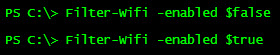
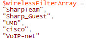
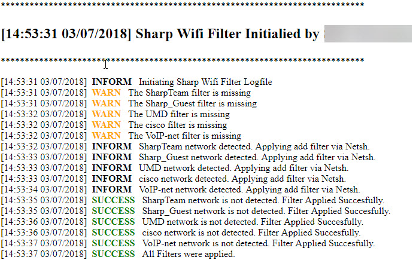

# Filter-Wifi
Filters out specified Wifi Networks to prevent users from connecting to incorrect networks. Assuming their wifi isn't managed by GPO.

Running the command: 

Specifing Wifi Networks to block: 

LogFile: 

